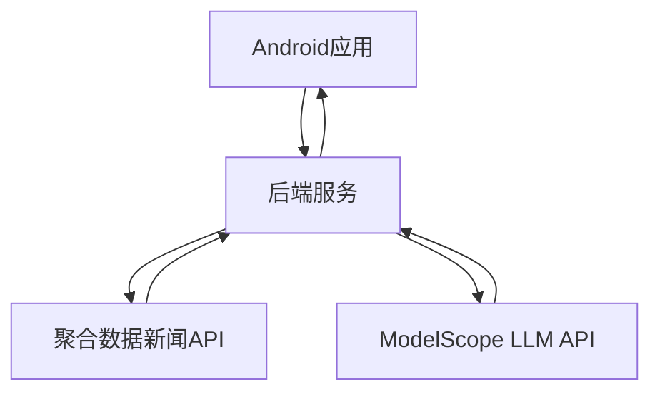

# PredictApp 新闻分析系统

## 系统概述

本系统为PredictApp添加了一个新闻获取与分析功能，通过后端服务完成核心处理逻辑。系统架构如下：

1. Android应用端：提供用户界面，发送请求并展示结果
2. 后端服务：处理新闻获取、LLM分析和数据处理
3. 新闻API：提供最新的财经新闻数据
4. LLM API：进行新闻分析和预测

## 功能特性

- 一键获取今日财经新闻分析
- 新闻摘要和关键要点提取
- 情感分析
- 市场趋势预测
- 用户友好的界面展示

## 系统架构



## 后端服务设置

### 环境要求

- Java 17+
- Gradle 7+

### 配置

1. 在 `backend/src/main/resources/application.properties` 中设置API密钥：
   ```
   # News API Configuration
   newsapi.url=https://api.jisuapi.com/news/get
   newsapi.appkey=YOUR_JUHE_API_KEY
   newsapi.channel=财经
   newsapi.num=10

   # LLM API Configuration
   llm.api.key=YOUR_MODELSCOPE_API_KEY
   llm.api.url=https://api.openai.com/v1/chat/completions
   llm.model=deepseek-ai/DeepSeek-V3.1-Terminus
   ```

2. 支持的环境变量：
   - `NEWS_API_KEY`: 聚合数据API的AppKey
   - `LLM_API_KEY`: ModelScope API密钥
   - `LLM_API_URL`: LLM API端点URL
   - `LLM_MODEL`: 使用的LLM模型

### 运行后端服务

```bash
cd backend
./gradlew bootRun
```

服务将在 `http://localhost:8080` 上运行。

## Android应用设置

### 环境要求

- Android Studio Flamingo或更高版本
- Android SDK API 34
- Kotlin 1.9+

### 配置

确保在 `app/build.gradle` 中正确配置了网络权限和依赖项。

### 运行Android应用

1. 在Android Studio中打开项目
2. 构建并运行应用
3. 确保后端服务正在运行
4. 在应用中点击"新闻分析"按钮获取分析结果

## API端点

- `GET /api/news/analyze` - 获取今日新闻分析和预测

## 数据模型

### NewsAnalysisResponse

```json
{
  "summary": "新闻摘要",
  "prediction": "预测结果",
  "keyPoints": ["要点1", "要点2", "要点3"],
  "sentiment": "情感分析结果",
  "success": true,
  "message": "错误信息（如果有）"
}
```

## 开发说明

### 后端服务结构

```
backend/
├── src/main/java/com/predictapp/news/
│   ├── controller/     # 控制器层
│   ├── service/        # 服务层
│   ├── model/          # 数据模型
│   ├── config/         # 配置类
│   └── NewsAnalysisApplication.java  # 应用主类
└── src/main/resources/
    └── application.properties        # 配置文件
```

### Android应用结构

```
app/
├── src/main/java/com/predictapp/
│   ├── data/
│   │   ├── api/        # API接口定义
│   │   ├── model/      # 数据模型
│   │   └── service/    # 网络服务
│   ├── ui/
│   │   ├── screen/     # UI屏幕组件
│   │   └── ...
│   └── ...
```

## 故障排除

1. **无法连接到后端服务**
   - 检查后端服务是否正在运行
   - 检查Android模拟器网络设置
   - 确认API端点URL正确

2. **API密钥错误**
   - 检查application.properties中的密钥配置
   - 确认API密钥有效且未过期

3. **LLM响应格式错误**
   - 检查LLM API返回的数据格式
   - 确认提示词设计符合要求

## 扩展功能

1. 添加更多新闻源支持
2. 实现历史数据分析功能
3. 增加个性化推荐
4. 添加图表可视化展示
5. 支持多语言分析